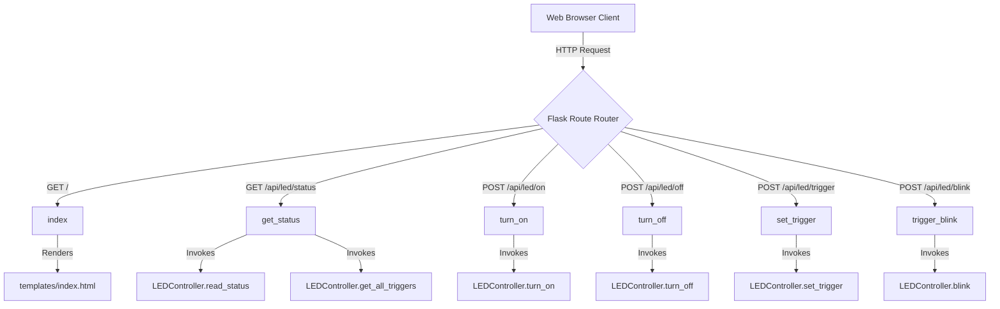

# Local Architecture: app.py

This document describes the structure, call relationships, inputs, and outputs of the Flask web server.

---

## 1. Call Hierarchy

The Flask app acts as a REST API gateway forwarding client browser HTTP requests to the controller.

---

## 2. Inputs & Outputs

### `index() -> str`
- **Inputs:** None.
- **Outputs:** Rendered HTML content from `templates/index.html`.

### `get_status() -> Response`
- **Inputs:** None.
- **Outputs:** JSON Response `{"status": "ON"|"OFF"|"ACTIVE", "brightness": int, "trigger": str, "available_triggers": list[str]}`.

### `turn_on() -> Response`
- **Inputs:** None.
- **Outputs:** JSON Response `{"success": true, "message": "LED turned ON"}`.

### `turn_off() -> Response`
- **Inputs:** None.
- **Outputs:** JSON Response `{"success": true, "message": "LED turned OFF"}`.

### `set_trigger() -> Response`
- **Inputs:** JSON Payload `{"name": "trigger_name"}` (e.g. `{"name": "heartbeat"}`).
- **Outputs:** JSON Response `{"success": true, "message": "Trigger changed to heartbeat"}`.

### `trigger_blink() -> Response`
- **Inputs:** JSON Payload `{"delay": float, "count": int}` (e.g. `{"delay": 0.5, "count": 5}`).
- **Outputs:** JSON Response `{"success": true, "message": "Successfully blinked 5 times"}`.

---

## 3. Design Choices & Rationale
- **Embedded Static Dashboard Serving:**
  Instead of utilizing separate static files folders (`static/css`, `static/js`), styling and script structures are embedded inside `templates/index.html`. This ensures the web dashboard is served instantly as a single unit, which is highly efficient for microdevices like the Raspberry Pi Zero 2W.
- **Dynamic Startup Permission Check:**
  If the application is launched without `sudo` privileges, the server does not immediately crash. Instead, it catches the exception and saves the error message. All subsequent API calls automatically return a `403 Forbidden` response along with the startup error. The client-side dashboard detects this and presents a clear warning dialog, improving the user experience.
