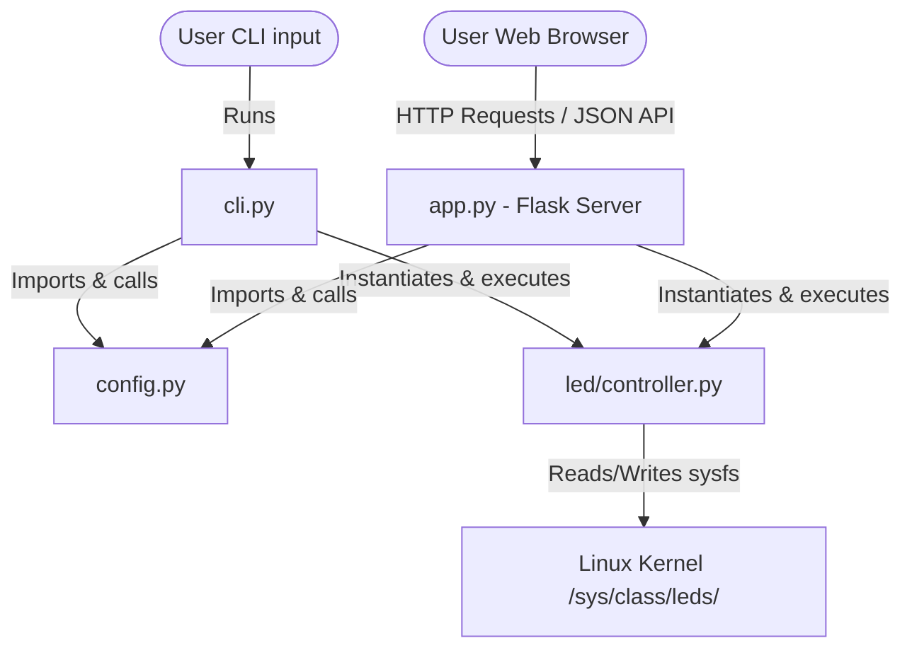

# Architecture Design: RPi Zero 2W LED Controller

This document outlines the global hierarchical function and module call structure, data flows, and architectural choices for the Raspberry Pi Zero 2W LED Controller.

---

## 1. System Architecture Diagram

The system supports two user interface entry points: a Command Line Interface (CLI) and a remote Web Browser Dashboard. Both interfaces leverage the core hardware controller module.



---

## 2. Module Call Hierarchy

```mermaid
flowchart TD
    subgraph Browser Client (HTML/JS)
        WEB[index.html] -->|fetch API| API{app.py REST API}
    end

    subgraph CLI Entry Point (cli.py)
        A[cli.main] --> B[cli.parse_arguments]
    end
    
    subgraph Web Entry Point (app.py)
        API -->|GET /| route_index[index]
        API -->|GET /api/led/status| route_status[status]
        API -->|POST /api/led/on| route_on[turn_on]
        API -->|POST /api/led/off| route_off[turn_off]
        API -->|POST /api/led/trigger| route_trig[set_trigger]
        API -->|POST /api/led/blink| route_blink[blink]
    end

    subgraph Configuration (config.py)
        C[get_led_base_path]
    end

    subgraph Core Control (led/controller.py)
        D[LEDController.__init__]
        E[LEDController.check_permissions]
        F[LEDController.turn_on]
        G[LEDController.turn_off]
        H[LEDController.read_status]
        I[LEDController.set_trigger]
        J[LEDController.get_trigger]
        K[LEDController.blink]
        L[LEDController.get_all_triggers]
    end

    A -->|1. Resolves path| C
    A -->|2. Instantiates| D
    A -->|3. Verifies root| E
    A -->|Option: on| F
    A -->|Option: off| G
    A -->|Option: status| H
    A -->|Option: status| J
    A -->|Option: trigger| I
    A -->|Option: blink| K
    
    route_status -->|Check path| C
    route_status -->|Check permissions| E
    route_status -->|Read status| H
    route_status -->|Read active and available triggers| L
    
    route_on -->|Turn LED ON| F
    route_off -->|Turn LED OFF| G
    route_trig -->|Set trigger| I
    route_blink -->|Blink LED| K

    K -->|Blink loop| F
    K -->|Blink loop| G
    K -->|Backup/Restore| J
    K -->|Backup/Restore| I
```

---

## 3. Data Flows (Inputs & Outputs)

| Step / Function | Input Data | Output Data / Side Effects | Description |
|---|---|---|---|
| `config.get_led_base_path()` | None (Checks CLI arguments, env vars `LED_SYSFS_PATH`) | `str` (Path to sysfs directory) | Resolves directory path to the target LED sysfs interface. |
| `LEDController.__init__(base_path)` | `base_path: str` | Instance variables initialized | Creates the controller pointing to the device paths. |
| `LEDController.check_permissions()` | None | None / Raises `PermissionError` | Checks write accessibility of critical files. |
| `LEDController.turn_on()` | None | Writes `"1"` to `brightness` file | Turns the physical LED on. |
| `LEDController.turn_off()` | None | Writes `"0"` to `brightness` file | Turns the physical LED off. |
| `LEDController.read_status()` | None | `int` (Brightness level, e.g. `0` or `1`) | Reads value from physical `brightness` file. |
| `LEDController.set_trigger(name)` | `trigger_name: str` | Writes trigger to `trigger` file | Alters operating system LED behavior. |
| `LEDController.get_trigger()` | None | `str` (Active trigger mode) | Reads trigger list and identifies active trigger. |
| `LEDController.get_all_triggers()` | None | `tuple[str, list[str]]` (Active trigger and list of available triggers) | Reads trigger list, extracts active trigger, and returns list. |
| `LEDController.blink(interval, count)` | `interval: float`, `count: int` | Flashes LED, restores original trigger on finish/interrupt | Blinks physical LED repeatedly. |
| `GET /api/led/status` | None | JSON `{"status": "ON"\|"OFF"\|"ACTIVE", "brightness": int, "trigger": str, "available_triggers": list[str]}` | Returns the active hardware status and triggers to the web frontend. |
| `POST /api/led/on` / `off` | None | JSON `{"success": true, "message": str}` | Rest API endpoints executing state toggles. |
| `POST /api/led/trigger` | JSON `{"name": str}` | JSON status | Rest API endpoint setting kernel triggers. |
| `POST /api/led/blink` | JSON `{"delay": float, "count": int}` | JSON status | Rest API endpoint performing blink loops. |

---

## 4. Architectural Choices & Rationale

- **Modular Separation of Concerns:**
  By isolating command line arguments (`cli.py`), web server endpoints (`app.py`), configuration values (`config.py`), and direct hardware sysfs modifications (`led/controller.py`), we achieve a clean codebase. If the hardware pathway shifts in the future (e.g. from sysfs files to a GPIO library), only `led/controller.py` will require modifications; both CLI and Web clients remain intact.
- **Flask Web Server:**
  Flask acts as a routing gateway between standard HTTP requests and local Python controller operations. It runs lightweight, has a very simple syntax, and does not require complex asynchronous event loop setups, making it optimal for headless execution on a Raspberry Pi Zero 2W.
- **Single-Page Fetch API Client:**
  The frontend user interface is served as a static HTML file that handles asynchronous updates via native Javascript `fetch()`. This prevents the browser from reloading the page during commands, leading to a smooth, responsive desktop/mobile dashboard feel.
- **Resource Protection and Graceful Interruption:**
  Linux sysfs trigger values are temporarily set to `none` during manual brightness writes, as automated system routines (e.g. disk write operations) would otherwise overwrite manual triggers. Restoring these triggers within `try...finally` statements guarantees that hardware defaults are restored even if execution is abruptly terminated.

