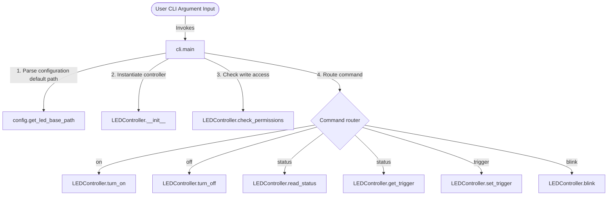

# Local Architecture: cli.py

This document describes the structure, call relationships, inputs, and outputs of the command-line interface execution.

---

## 1. Call Hierarchy

The main entry point of the CLI utility configures subcommands and acts as a controller router.

---

## 2. Inputs & Outputs

### `main() -> None`
- **Inputs:** CLI Arguments read from `sys.argv` (e.g. `['blink', '--delay', '0.2', '--count', '10']`).
- **Outputs:** Printed execution reports to `stdout`, or descriptive errors to `stderr`.
- **System Termination:**
  - `sys.exit(0)` on clean exit or keyboard interrupt (`Ctrl+C`).
  - `sys.exit(1)` on catching `PermissionError` or `FileNotFoundError`.

---

## 3. Design Choices & Rationale
- **Subparsers Architecture (`argparse`):**
  Instead of manual keyword matching in `sys.argv`, we use `subparsers`. This guarantees robust parameter type checks, automatic help generation (`--help`), and structured routing out-of-the-box.
- **Top-Level Error Management:**
  The `main()` method is encapsulated in a comprehensive `try...except` block. This keeps helper module code dry and ensures that error reporting (e.g., advising the user to execute the script with `sudo` permissions) occurs consistently at the application boundary.
