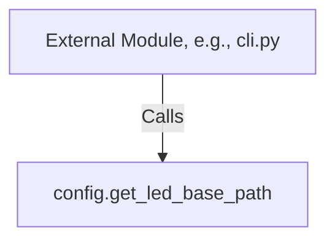

# Local Architecture: config.py

This document describes the structure and call relationships within the configuration module.

---

## 1. Call Hierarchy

The configuration module has a single utility function with no internal helper dependencies.

---

## 2. Inputs & Outputs

### `get_led_base_path() -> str`
- **Inputs:** None.
- **Outputs:** `str` representing the resolved filesystem path to the Raspberry Pi's sysfs LED controller directory (e.g. `"/sys/class/leds/ACT"`).
- **Side Effects:** None (Pure read operation of environment variables).

---

## 3. Design Choices & Rationale
- **Stateless Configuration:**
  Instead of loading configuration into class instances or caching variables globally, the path is fetched dynamically via a simple function call. This prevents state contamination and simplifies debugging.
- **Standard Library Only:**
  Using Python's built-in `os.environ` avoids introducing third-party configuration tools (like `pydantic-settings`), making the script zero-dependency and easier for beginners to run and learn from.
