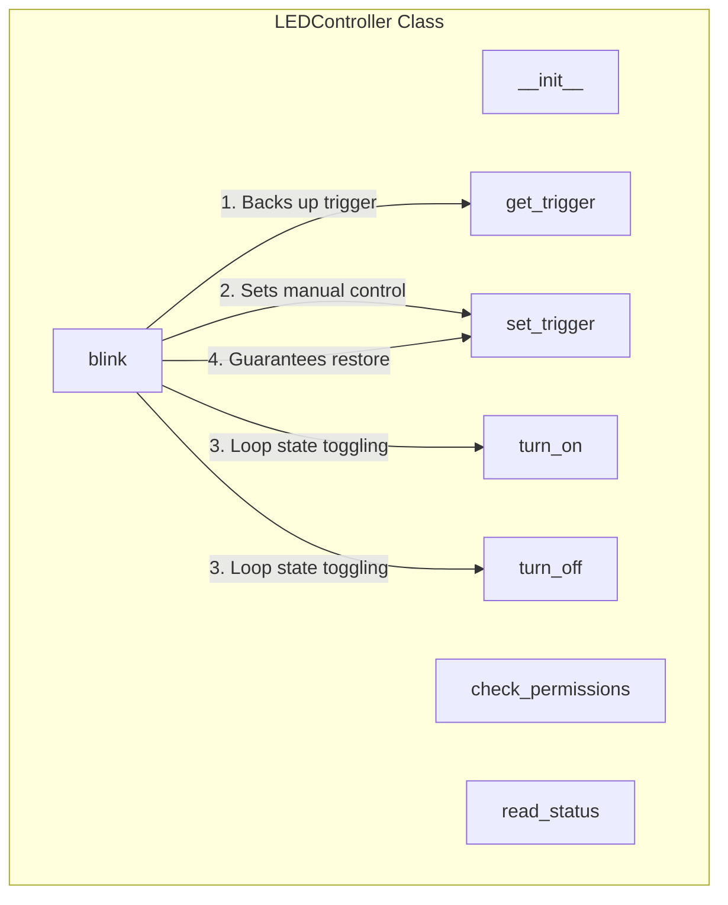

# Local Architecture: led/controller.py

This document describes the structure, call relationships, inputs, and outputs of the core LEDController module.

---

## 1. Call Hierarchy

The `LEDController` class encapsulates all logic interacting with the Linux `/sys/class/leds/` file entries.

---

## 2. Inputs & Outputs

### `__init__(base_path: str)`
- **Inputs:** `base_path: str` (target sysfs folder path).
- **Outputs:** None.

### `check_permissions() -> None`
- **Inputs:** None.
- **Outputs:** None.
- **Exceptions:**
  - `FileNotFoundError`: If target sysfs path or files don't exist.
  - `PermissionError`: If files are not writable (e.g. not run as root).

### `turn_on() -> None`
- **Inputs:** None.
- **Outputs:** None (Writes `"1"` to `brightness` file).

### `turn_off() -> None`
- **Inputs:** None.
- **Outputs:** None (Writes `"0"` to `brightness` file).

### `read_status() -> int`
- **Inputs:** None.
- **Outputs:** `int` (current brightness level value, e.g. `0` or `1`).

### `get_trigger() -> str`
- **Inputs:** None.
- **Outputs:** `str` (the name of the active kernel trigger).

### `set_trigger(trigger_name: str) -> None`
- **Inputs:** `trigger_name: str` (trigger name to write).
- **Outputs:** None (Writes string to `trigger` file).

### `blink(interval: float, count: int) -> None`
- **Inputs:**
  - `interval: float`: seconds to pause between state toggles.
  - `count: int`: total blink cycles.
- **Outputs:** None (Flashes LED and restores active trigger).

---

## 3. Design Choices & Rationale
- **Direct sysfs Toggling:**
  Instead of utilizing heavier third-party GPIO libraries that need compilation (e.g., `RPi.GPIO` or `gpiozero`), writing to `sysfs` LED files is standard under DietPi, extremely fast, requires no dependencies, and is very educational.
- **Blink Cleanup Guarantee:**
  Automated triggers like `heartbeat` or disk writes will override any custom brightness set by `turn_on`/`turn_off`. Therefore, the script switches the trigger to `none` before blinking. Using a `try...finally` block ensures that even if the loop is aborted via `KeyboardInterrupt` (Ctrl+C), the original trigger is safely restored.
