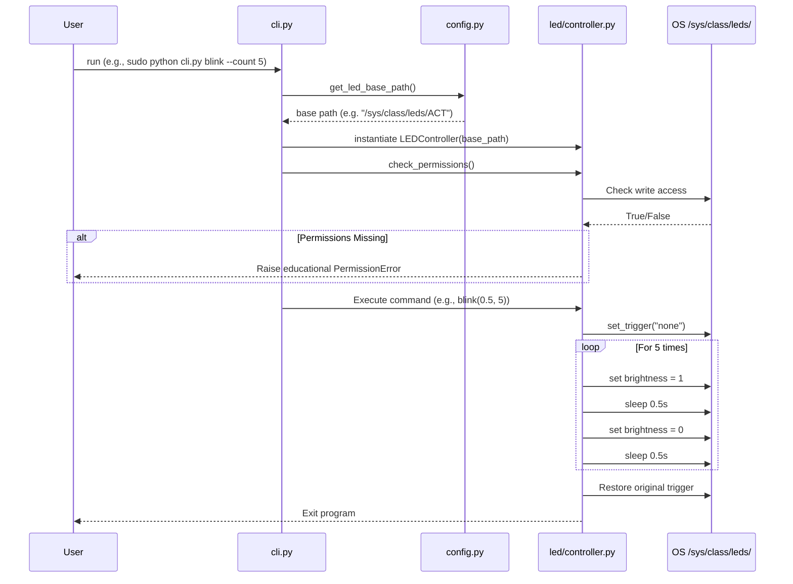

# Technical Plan: Raspberry Pi Zero 2W LED Controller

This document details the technical implementation plan (the HOW) for the Python LED controller utility.

---

## Technical Stack & Versions
- **Language:** Python 3.12+ (Standard Library only).
- **Libraries Used (All built-in, zero external dependencies to maximize simplicity and ease of learning):**
  - `argparse`: For parsing command-line interfaces.
  - `os`: For checking root permissions and file path access.
  - `sys`: For system-level interactions and status exits.
  - `time`: For interval delays during blinking.
  - `signal`: For capturing Ctrl+C (SIGINT) to ensure graceful restoration of LED states.

---

## Folder Architecture
```text
rpi-led-controller/
│
├── config.py                 # Handles environment variable loading and path configuration
├── cli.py                    # Entry point; parses arguments and invokes the controller
│
├── led/
│   ├── __init__.py           # Makes led a package
│   └── controller.py         # Interfaces with sysfs file paths to set/get LED properties
│
└── tests/
    ├── __init__.py
    └── test_controller.py    # Unit tests mocking file I/O operations
```

---

## Contracts & Interfaces

### `config.py`
```python
def get_led_base_path() -> str:
    """
    Returns the target path to the sysfs LED directory.
    Priority: CLI Override Argument > Environment Variable 'LED_SYSFS_PATH' > Default '/sys/class/leds/ACT'
    """
```

### `led/controller.py`
```python
class LEDController:
    def __init__(self, base_path: str):
        """Initializes controller with base path to the sysfs files."""
        ...

    def check_permissions(self) -> None:
        """
        Checks if the script has write permission to the trigger and brightness files.
        Raises PermissionError with an educational instruction if not run under sudo.
        """
        ...

    def turn_on(self) -> None:
        """Writes '1' to the brightness file."""
        ...

    def turn_off(self) -> None:
        """Writes '0' to the brightness file."""
        ...

    def read_status(self) -> int:
        """Reads and returns the value from the brightness file."""
        ...

    def set_trigger(self, trigger_name: str) -> None:
        """Writes the trigger name (e.g., 'none', 'heartbeat') to the trigger file."""
        ...

    def get_trigger(self) -> str:
        """Reads and returns the active trigger from the trigger file."""
        ...

    def blink(self, interval: float, count: int) -> None:
        """
        Temporarily sets trigger to 'none', blinks the LED 'count' times 
        with 'interval' sleep intervals, and cleans up on completion or interrupt.
        """
        ...
```

---

## Execution Sequence


---

## Technical Decisions & Rationale

1. **Standard Library Only:**
   - *Decision:* Avoid third-party packages like `pydantic` or CLI libraries like `typer`.
   - *Rationale:* Since this tool runs on a resource-constrained environment (RPi Zero 2W) and is meant for learning, removing external dependencies makes execution fast, avoids environment conflicts on DietPi, and serves as a pure Python learning guide.
2. **sysfs File Interface:**
   - *Decision:* Read/write to `/sys/class/leds/ACT/brightness` and `/sys/class/leds/ACT/trigger` directly as files.
   - *Rationale:* Under DietPi/Debian Linux, the kernel exposes hardware LEDs as virtual files. Writing "1" or "0" directly is standard practice, works out-of-the-box, and teaches basic file I/O, which is highly educational.
3. **Signal Interrupt Handling:**
   - *Decision:* Use `signal` or `try...finally` block inside the controller/CLI execution.
   - *Rationale:* If the user presses `Ctrl+C` while the LED is blinking, the LED could get stuck in an ON/OFF state or remain with the `none` trigger. A cleanup block ensures the LED is returned to its default system trigger (e.g., `mmc0`).

---
