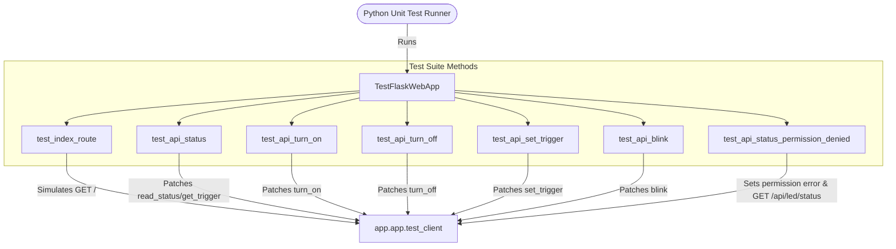

# Local Architecture: tests/test_app.py

This document describes the structure and test coverage for the Flask web application route tests.

---

## 1. Call Hierarchy

The test module utilizes the `unittest` framework and Flask `test_client`. It patches the controller instantiated inside `app.py` to prevent real file accesses.

---

## 2. Inputs & Outputs

### `TestFlaskWebApp` Class
- **Inputs:** None (Orchestrated by Python `unittest` framework runner).
- **Outputs:** Console output reporting test success or failure codes.
- **Side Effects:** Simulates HTTP requests against Flask's WSGI application using the built-in testing interface.

---

## 3. Design Choices & Rationale
- **Flask Test Client integration:**
  Using Flask's built-in `test_client()` allows for fast, isolated HTTP unit tests. We don't need to spin up a real web server bound to a TCP port, meaning tests run instantly and can run concurrently on standard continuous integration (CI) platforms.
- **Mocking at Module Boundary:**
  Since `app.py` initializes the `LEDController` at import time, we mock its instance methods (like `turn_on`, `turn_off`, etc.) dynamically via `@patch` decorators. This separates the testing of routing/HTTP translation from the underlying physical filesystem reads/writes.
